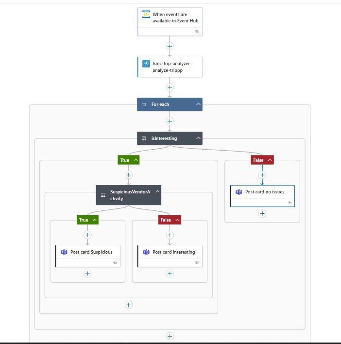

# Real-Time Trip Event Analysis – Azure Event-Driven Architecture

This project demonstrates a real-time taxi trip analysis system using Azure Event Hub, Azure Functions, and Logic Apps to classify trips and notify teams with insights.

---

## Architecture Overview



**Components:**

- **Azure Event Hub:** Ingests trip events in real-time.
- **Azure Function (`func-trip-analyzer --> analyze-trippp`)**: Processes each trip, detects patterns like cash payments or suspicious vendor activity.
- **Azure Logic App (`trip-logic-app`)**: 
  - Triggers when a new event is available in Event Hub.
  - Iterates over each trip item.
  - Applies conditions to classify trips as:
    - ⚠️ **Suspicious Trip**
    - 🚨 **Interesting Trip**
    - ✅ **Normal Trip**
  - Sends Adaptive Cards to Microsoft Teams channel accordingly.

---

## Azure Function Logic

The `func-trip-analyzer-analyze-tripp` function:
- Accepts incoming trip data in JSON format.
- Analyzes each trip for:
  - Vendor ID anomalies (`V009`)
  - Payment type (`CashPayment`)
  - Distance or passenger irregularities
- Returns enriched trip records with computed `insights` (e.g., `SuspiciousVendorActivity`, `CashPayment`, etc.).

Sample logic:
```python
if vendor_id == 'V009':
    insights.append('SuspiciousVendorActivity')
if payment_type == 2:
    insights.append('CashPayment')
```

---

## Example Input & Output

### ✅ Normal Input
```json
{
  "vendorID": "V008",
  "tripDistance": 6.2,
  "passengerCount": 1,
  "paymentType": 1
}
```
### Output
```
Summary: Trip normal
Insights: []
```

### 🚨 Interesting Input
```json
{
  "vendorID": "V010",
  "tripDistance": 18.5,
  "passengerCount": 2,
  "paymentType": 2
}
```
### Output
```
Summary: Interesting trip
Insights: ["LongTrip", "CashPayment"]
```

### ⚠️ Suspicious Input
```json
{
  "vendorID": "V009",
  "tripDistance": 0.8,
  "passengerCount": 1,
  "paymentType": 2
}
```
### Output
```
Summary: Interesting trip with suspicious vendor
Insights: ["CashPayment", "SuspiciousVendorActivity"]
```

---

## Adaptive Card Examples (Posted to Teams)

- **Suspicious Trip Detected**
  - ⚠️ Header: "Suspicious Vendor Activity Detected"
  - Details: Vendor, Distance, Passengers, Payment, Insights

- **Interesting Trip**
  - 🚨 Header: "Interesting Trip Detected"
  - Triggered by Cash Payment or long-distance.

- **Normal Trip**
  - ✅ Header: "Trip Analyzed - No Issues"

---

## Suggested Improvements

- Visualize suspicious activity in Power BI dashboards.
- Add alerts for specific patterns using Azure Monitor.

---

## Demo Video

